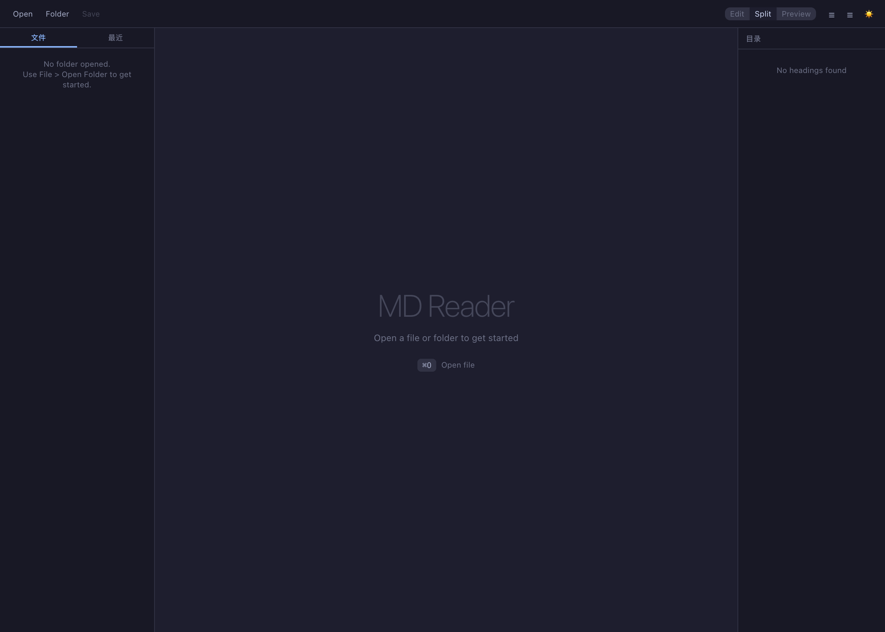

# MD Reader

一款简洁优雅的 Markdown 阅读器，基于 Tauri + React + TypeScript 构建的桌面应用。



## 功能特性

### 文件管理
- 打开单个 Markdown 文件或整个文件夹
- 文件树浏览，快速定位 `.md` 文件
- 最近文件列表，支持置顶常用文件
- 外部修改自动检测，提示刷新

### 编辑与预览
- **预览模式** — 渲染后的 Markdown 文档阅读
- **编辑模式** — CodeMirror 编辑器，支持语法高亮
- **分屏模式** — 左侧编辑、右侧实时预览
- 支持 GitHub Flavored Markdown（表格、任务列表、删除线等）
- 100+ 编程语言代码块语法高亮

### 目录导航 (TOC)
- 自动从标题生成文档目录
- 点击跳转到对应章节
- 当前阅读位置高亮
- 支持折叠/展开

### 外观与主题
- 亮色 / 暗色 / 跟随系统 三种主题
- 预览字号可调（12px - 24px）
- 中文 / English 双语切换
- macOS 原生透明标题栏

## 键盘快捷键

| 快捷键 | 功能 |
|--------|------|
| `Cmd + O` | 打开文件 |
| `Cmd + S` | 保存文件 |
| `Cmd + Shift + S` | 另存为 |
| `Cmd + N` | 新建文件 |
| `Cmd + B` | 显示/隐藏侧边栏 |
| `Cmd + Shift + T` | 显示/隐藏目录 |

## 安装使用

### 直接下载

前往 [Releases](https://github.com/shehuiyao/mdreader/releases) 页面下载 `.dmg` 安装包（macOS）。

### 从源码构建

**环境要求：**
- Node.js >= 18
- Rust (最新稳定版)
- macOS / Windows / Linux

```bash
# 克隆仓库
git clone https://github.com/shehuiyao/mdreader.git
cd mdreader

# 安装依赖
npm install

# 开发模式运行
npm run tauri dev

# 构建生产版本
npm run tauri build
```

构建产物位于 `src-tauri/target/release/bundle/` 目录下。

## 技术栈

| 层级 | 技术 |
|------|------|
| 框架 | [Tauri 2](https://tauri.app/) |
| 前端 | React 19 + TypeScript |
| 状态管理 | Zustand |
| 编辑器 | CodeMirror 6 |
| Markdown 渲染 | react-markdown + remark-gfm + rehype |
| 样式 | Tailwind CSS 4 |
| 后端 | Rust |

## License

MIT
